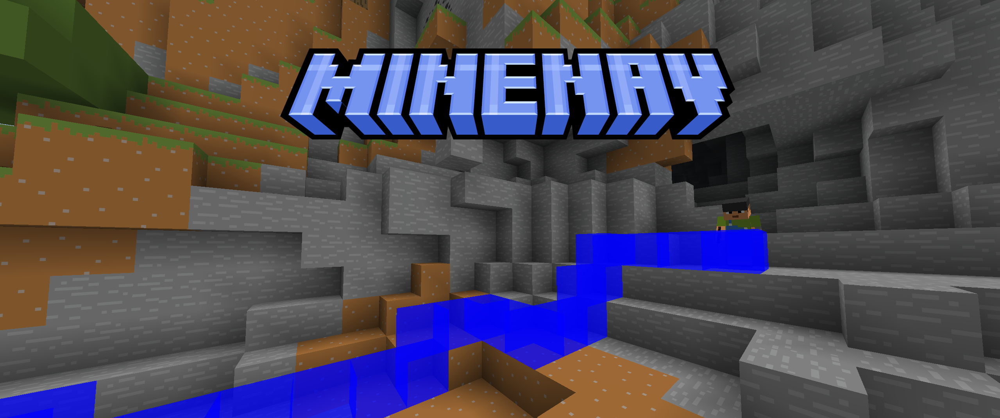
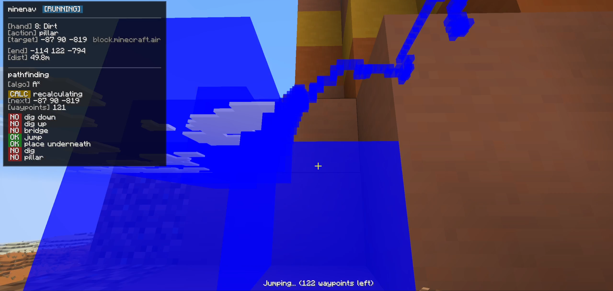

# minenav

minenav is a small project that was heavily inspired by [Baritone](https://github.com/cabaletta/baritone) and what you should use if you actually want a reliable pathfinder bot for Minecraft.

## features
 - navigates terrain
 - bridges and goes up and down mountains
 - automatically mines and places blocks to get to destination
 - automatically selects tools and blocks for the job
 - can find and mine specific blocks



## how it works

minenav uses pathfinding algorithms to navigate your Minecraft world:

- **A\*** - classic pathfinding, finds the optimal path
- **Anytime D\*** - starts with a rough path and refines it over time, better for dynamic environments and recalculation

the mod takes a 3D snapshot of the world around you, calculates costs for each block (air = walkable, solid = obstacle, falling = expensive), then finds the best path. it runs the heavy pathfinding in a background thread so your game doesn't freeze.

once it has a path, it automatically:
- aims your camera at the next waypoint
- presses movement keys (WASD, jump, sneak)
- places blocks when bridging or pillaring
- breaks blocks when digging or mining
- switches to the right tool/block in your hotbar

it recalculates the path every second (or when it gets stuck) to adapt to changes in the world.

## how to get it working

### development setup
1. clone this repo
2. open it in IntelliJ IDEA
3. let Gradle sync (it'll download Minecraft and dependencies)
4. run the `Minecraft Client` configuration (green play button)
5. the game will launch with the mod loaded

### building the mod
```bash
./gradlew build
```
the compiled `.jar` will be in `build/libs/`

### installing
1. install [Fabric Loader](https://fabricmc.net/use/)
2. install [Fabric API](https://modrinth.com/mod/fabric-api)
3. drop the minenav jar into your `.minecraft/mods/` folder

## how to use

all commands are chat commands that start with `!`:

### basic navigation
- `!start` - set your current position as the starting point
- `!end` - set your current position as the destination
- `!go` - start pathfinding to the destination
- `!stop` - stop pathfinding

### finding blocks
- `!mine <block>` - finds and navigates to the nearest block of that type
  - examples: `!mine diamond_ore`, `!mine dirt`, `!mine oak_log`
  - uses fuzzy matching so you can type `!mine polished diorite` and it'll work

### algorithm selection
- `!algo` - check which pathfinding algorithm is active
- `!algo astar` - switch to A*
- `!algo adstar` - switch to Anytime D*
- `!algo toggle` - toggle between the two

### example workflow
```
!end          (stand where you want to go)
!start        (go back to where you want to start)
!go           (watch it navigate)
!stop         (if you want to stop early)
```

or just:
```
!mine diamond_ore
```

## hud

when navigating, you'll see a HUD in the top-left showing:
- current action (moving, bridging, digging, etc.)
- next waypoint coordinates
- remaining waypoints
- selected tool/block
- active movement options (can it bridge? jump? dig?)

## license

MIT - see [LICENSE.txt](LICENSE.txt)